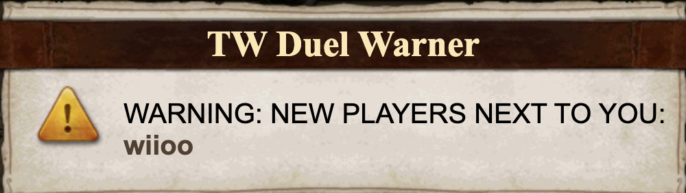
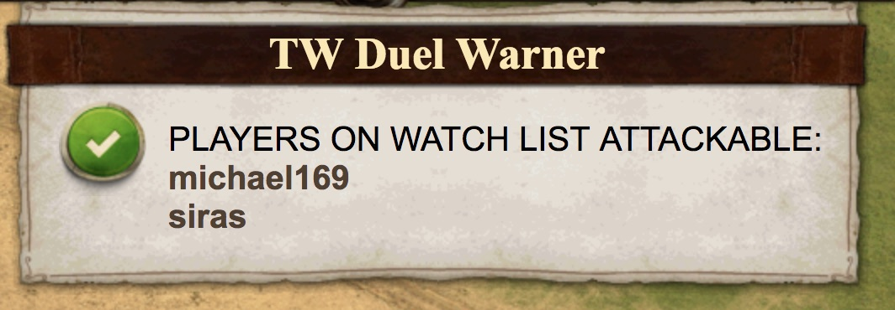
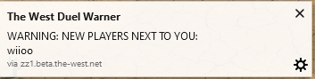
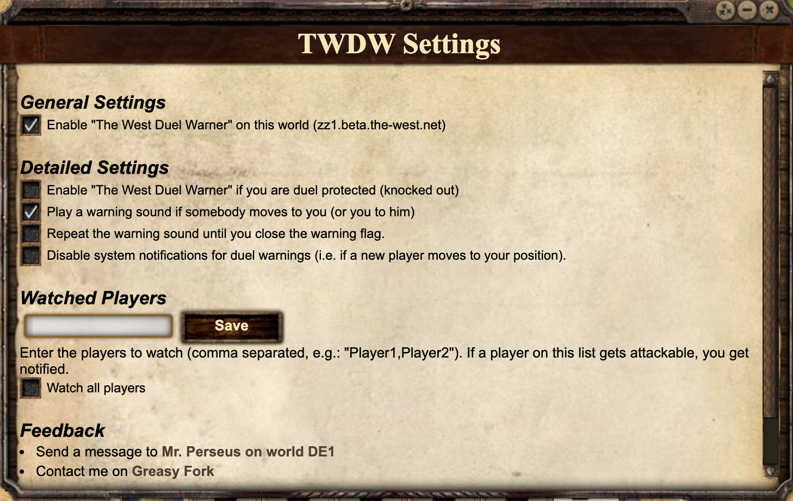

## Install URL

[Click here to install](https://the-west-scripts.github.io/tw-duel-warner/script.user.js)

## Description & Sreenshots

Userscript for The West. Warns if somebody is in duel range.

**Duel warner**  
Warns if someone moves to your position. A sound gets played and the following flag is shown:

**New players attachable**
Warns if a player got attackable (which means for a player with character class "Dueller" that he could be attacking you).

**System Notification**
For the two features above, fire a system notification.

**Settings**
Configure The West Duel Warner. Please refresh the page after changing anything.

## Comments

[It's now officially allowed to use this script on German worlds.](https://forum.the-west.de/index.php?threads/aktuelle-%C3%9Cbersicht-aller-skripte-2020.75033/)

[Report a bug](https://github.com/The-West-Scripts/tw-duel-warner/issues/new)

[Greasyfork listing](https://greasyfork.org/en/scripts/40902-the-west-duel-warner)

## Installation

Install first the browser extension for your browser:

-    Firefox: [Greasemonkey](https://addons.mozilla.org/firefox/addon/greasemonkey/)
-    Chrome: [Tampermonkey](https://chrome.google.com/webstore/detail/tampermonkey/dhdgffkkebhmkfjojejmpbldmpobfkfo/)
-    Microsoft Edge: [Tampermonkey](https://www.microsoft.com/store/p/tampermonkey/9nblggh5162s/)
-    Safari: [Tampermonkey](https://safari.tampermonkey.net/tampermonkey.safariextz)
-    Opera: [Tampermonkey](https://addons.opera.com/extensions/details/tampermonkey-beta/)

Now install the user script.

**Smartphones & Tablets**

-   Create a new bookmark in your mobile browser
-   Edit the bookmark and copy this to its address field:

`javascript:document.body.appendChild(document.createElement('script')).src='https://the-west-scripts.github.io/tw-duel-warner/script.user.js'`

-   Now open the game and click the bookmark to start the script
